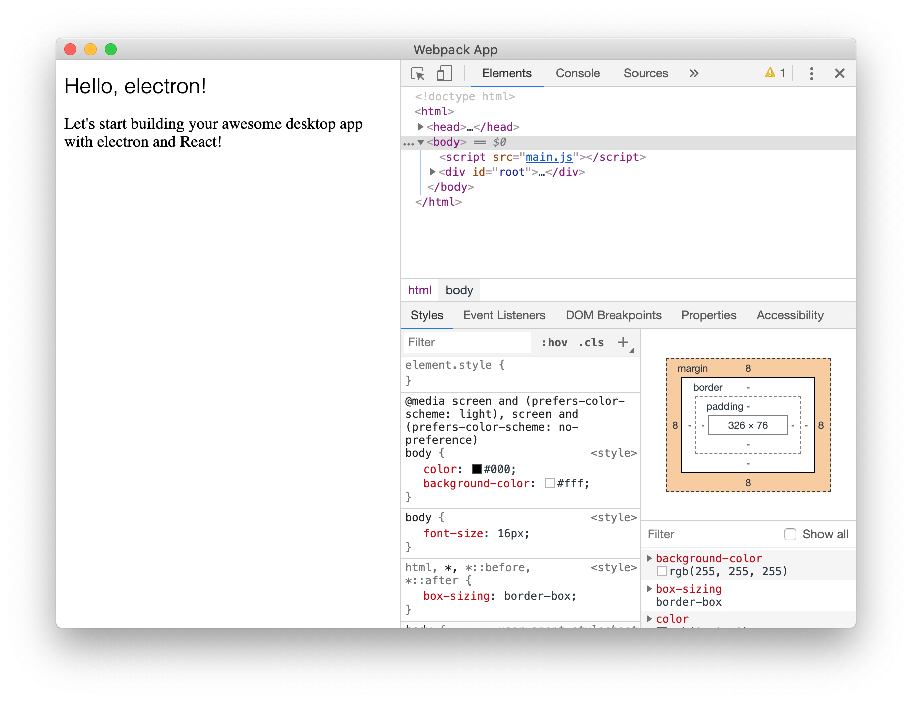
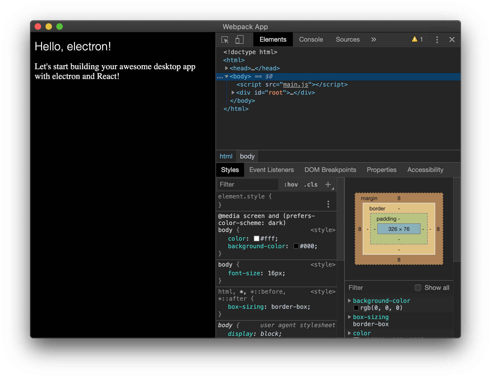

# 從 0 到 E(lectron) - 打造 Electron App (feat. React)

## 前言

[Electron](https://www.electronjs.org) 是一個以 web 開發技術為基礎，打造跨平台 Desktop App 的框架。

官網的簡介如下：
> If you can build a website, you can build a desktop app. Electron is a framework for creating native applications with web technologies like JavaScript, HTML, and CSS. It takes care of the hard parts so you can focus on the core of your application.

也就是說，只要我們熟悉 HTML、CSS 及 JavaScript，我們就可以打造跨平台的 Desktop App。

Electron 是 GitHub 的開源專案，現在有很多產品都是使用 Electron 製作 Desktop App，例如：VS Code（我正用 VS Code撰寫這份文件）、Spotify、Slack、Twitch、GitHub 自家的 Code Editor - Atom 等，這些有名的 Desktop App 都是 Electron App。還有更多的 Electron App，請參考官網的[列表](https://www.electronjs.org/apps)。

因此，若我們已使用過 web 開發技術開發一些 web app，用同樣的 code base 開發 desktop app 也是一個不錯的嘗試。

接下來會用 Electron 搭配 React 來說明如何從零開始打造一個 Electron app 專案

## 設定 NPM

在專案的根目錄下建立一個 `package.json`，加入以下內容

```json
// root/package.json
{
  "name": "electron-react-app",
  "productName": "electron-react-app",
  "version": "1.0.0",
  "homepage": "./",
  "main": "main.js",
  "scripts": {},
  "dependencies": {},
  "devDependencies": {}
}
```

`productName` 是給 `electron-packager` 打包 App 時用的，`homepage` 是專案的主頁，也是之後 React 渲染的主頁。另外特別注意到，`main` 定義 Electron 主程序（main process）的檔案：`main.js`，會在之後建立這個檔案。

## 建立 React App

建立 React App 有兩種方式，第一種是大家常用的，利用 `create-react-app` 建立，第二種則是自己手動建立樣板、設定檔。在此我們選擇第二種方式來建立專案。因為我們可以設定更多關於 webpack 的細節。

更重要的是，若我們使用 `create-react-app` 建立 React app，就必須同時啟動兩個 server，一個給 Electron，另一個給 React。

我們安裝 `react` 及 `react-dom`。

```bash
# In terminal, use npm to install:
npm install react react-dom

# or use yarn
yarn add react react-dom
```

值得注意的是，我們不需要 `react-scripts`，因為在接下來的 webpack 設定中，會設定一些 script 指令。

## 建立 React Component

安裝完成之後，我們可以開始加入一些 React component 了！以往使用 `create-react-app` 建立專案的時候，會建立兩個基本的 component：`index.js` 及 `app.js`，現在讓我們來建立這兩個檔案。

在根目錄下建立 `src` 資料匣，並建立一個 `index.js`：

```javascript
// src/index.js

// Import dependencies
import React from "react";
import { render } from "react-dom";

// Import main App component
import App from "./components/app";

// Import CSS stylesheet
import "./assets/css/app.css";

// Since we are using HtmlWebpackPlugin WITHOUT a template, we should create our own root node in the body element before rendering into it
let root = document.createElement("div");

// Append root div to body
root.id = "root";
document.body.appendChild(root);

// Render the app into the root div
render(<App />, document.getElementById("root"));
```

在 `index.js` 裡，我們引入需要的 dependency、App component、css 等。然後創建一個 `div`，並在這個 `div` 上渲染 React app。

有一件事不是必須做的，就是建立一個 `index.html` 檔案。因為 webpack 及 `html-webpack-plugin` 會幫你建立，我們只需要建立一個 `div` 並掛載到 `body` 即可。

接下來要建立 `app.js`，也就是 React app 的最底層 component。在 `src` 資料匣下建立一個 `components` 的資料匣，並在裡面建立 `app.js`。我們的 component 就寫在這裡：

```javascript
// src/components/app.js

// Import dependencies
import React from "react";

// Create main App component
const App = () => (
  <div>
    <h1>Hello, electron!</h1>

    <p>Let's start building your awesome desktop app with electron and React!</p>
  </div>
);

// Export the App component
export default App;
```

如果使用 `create-react-app` 建立專案的話，在這裡面會有一個大大的 React logo。然而這裡我們只要簡單的幾行文字，在 Electron 掛載的時候，確定這個 component 有渲染出來即可。

## 加入 CSS

React app 這邊差不多完成了，只缺了樣式，上面在建立 `index.js` 的時候有引入一個 css 檔，讓我們來建立它。其實當 Electron app 啟動時， 我們只是要先確認 React component 是否有正確渲染的話，是沒有必用到 css 的。而這裡加入 css 主要的目的是：**Electron 可以偵測作業系統的主題/模式（例如：Mac OSX 的 Dark Mode），並依據模式改變 Electron app 的樣式（如果我們有寫多種樣式的話）**

在 `src/assets/css/` 下建立 `app.css`：

```css
/* src/assets/css/app.css */

/* Main CSS stylesheet */
html,
*,
*::before,
*::after {
  box-sizing: border-box;
}

body {
  font-size: 16px;
}

@media screen and (prefers-color-scheme: light), screen and (prefers-color-scheme: no-preference) {
  /* Light mode */
  body {
    color: #000;
    background-color: #fff;
  }
}

@media screen and (prefers-color-scheme: dark) {
  /* Dark mode */
  body {
    color: #fff;
    background-color: #000;
  }
}

h1 {
  font-family: Helvetica, Arial, sans-serif;
  font-size: 21px;
  font-weight: 200;
}
```

`@media screen and (prefers-color-scheme: dark)` 裡面定義了作業系統在 Dark Mode 的樣式，稍後可以在 Electron app 啟動之後查看結果。

這裡定義 Light Mode 的時候是**白底黑字**，Dark Mode 的時候是**黑底白字**。

## 加入 Electron

React 的部分告一段落，接下來是這次的主角：Electron

首先安裝相關的套件：

```bash
# use npm
npm install -D electron electron-packager

# or use yarn
yarn add -D electron electron-packager
```

`electron-packager` 會將 Electron 打包成各作業系統的 app 格式，例如：`.app`、`.exe`、`.zip`、`.deb` 等。

另外還可以安裝 `electron-devtools-installer`，如此在開發的時候，就在 Electron app 中開啟自行安裝的開發者檢查工具（例如：React Developer Tools、Vue.js Devtools、Augury 等）

```bash
# use npm
npm install -D electron-devtools-installer

# or use yarn
yarn add -D electron-devtools-installer
```

## 設定 Electron 的主程序（main process）

要啟動一個 Electron app 就需要一個主程序（main process）

第一，他用來建立 Electron app window

第二，他負責載入由 webpack 產生的 `index.html`

第三，執行關閉 app window

此外，我們也會在主程序裡加入 `React Developer Tools`，以方便開發。在根目錄下建立一個 `main.js`：

```javascript
// main.js

"use strict";

// Import parts of electron to use
const { app, BrowserWindow } = require("electron");
const path = require("path");
const url = require("url");

// Add React extension for development
const { default: installExtension, REACT_DEVELOPER_TOOLS } = require("electron-devtools-installer");

// Keep a global reference of the window object, if you don't, the window will
// be closed automatically when the JavaScript object is garbage collected.
let mainWindow;

// Keep a reference for dev mode
let dev = false;

// Determine the mode (dev or production)
if (
  process.defaultApp ||
  /[\\/]electron-prebuilt[\\/]/.test(process.execPath) ||
  /[\\/]electron[\\/]/.test(process.execPath)
) {
  dev = true;
}

// Temporary fix for broken high-dpi scale factor on Windows (125% scaling)
// info: https://github.com/electron/electron/issues/9691
if (process.platform === "win32") {
  app.commandLine.appendSwitch("high-dpi-support", "true");
  app.commandLine.appendSwitch("force-device-scale-factor", "1");
}

function createWindow() {
  // Create the browser window.
  mainWindow = new BrowserWindow({
    width: 1024, // width of the window
    height: 768, // height of the window
    show: false, // don't show until window is ready
    webPreferences: {
      nodeIntegration: true,
    },
  });

  // and load the index.html of the app.
  let indexPath;

  // Determine the correct index.html file
  // (created by webpack) to load in dev and production
  if (dev && process.argv.indexOf("--noDevServer") === -1) {
    indexPath = url.format({
      protocol: "http:",
      host: "localhost:8080",
      pathname: "index.html",
      slashes: true,
    });
  } else {
    indexPath = url.format({
      protocol: "file:",
      pathname: path.join(__dirname, "dist", "index.html"),
      slashes: true,
    });
  }

  // Load the index.html
  mainWindow.loadURL(indexPath);

  // Don't show the app window until it is ready and loaded
  mainWindow.once("ready-to-show", () => {
    mainWindow.show();

    // Open the DevTools automatically if developing
    if (dev) {
      installExtension(REACT_DEVELOPER_TOOLS).catch((err) => console.log("Error loading React DevTools: ", err));
      mainWindow.webContents.openDevTools();
    }
  });

  // Emitted when the window is closed.
  mainWindow.on("closed", function () {
    // Dereference the window object, usually you would store windows
    // in an array if your app supports multi windows, this is the time
    // when you should delete the corresponding element.
    mainWindow = null;
  });
}

// This method will be called when Electron has finished
// initialization and is ready to create browser windows.
// Some APIs can only be used after this event occurs.
app.on("ready", createWindow);

// Quit when all windows are closed.
app.on("window-all-closed", () => {
  // On macOS it is common for applications and their menu bar
  // to stay active until the user quits explicitly with Cmd + Q
  if (process.platform !== "darwin") {
    app.quit();
  }
});

app.on("activate", () => {
  // On macOS it's common to re-create a window in the app when the
  // dock icon is clicked and there are no other windows open.
  if (mainWindow === null) {
    createWindow();
  }
});
```

##### PS. 若我們不想用 main 這個名字，記得在更改檔名的時候，也要順便到 `package.json` 裡修改 `main` 所指向的檔案名稱，使之同步。

## 加入 webpack 及設定

Electron 與 React 都差不多完成了，接下來是 webpack 的部分。
我們要建立兩個 webpack 的設定檔，一個是給 development 環境（`webpack.dev.config.js`），另一個是 production 環境（`webpack.build.config.js`）。

這兩個設定檔的差別在於 `webpack.dev.config.js` 將會使用 webpack devServer 及 source maps。此外，production 環境將使用 `mini-css-extract-plugin`、`babili-webpack-plugin` 做優化及壓縮等處理。除了以上的差異外，其他部分都相同。

Development 環境的設定：

```javascript
// webpack.dev.config.js

const webpack = require("webpack");
const path = require("path");
const HtmlWebpackPlugin = require("html-webpack-plugin");
const { spawn } = require("child_process");

// Any directories you will be adding code/files into, need to be added to this array so webpack will pick them up
const defaultInclude = path.resolve(__dirname, "src");

module.exports = {
  module: {
    rules: [
      {
        test: /\.css$/,
        use: [{ loader: "style-loader" }, { loader: "css-loader" }],
        include: defaultInclude,
      },
      {
        test: /\.jsx?$/,
        use: [{ loader: "babel-loader" }],
        include: defaultInclude,
      },
      {
        test: /\.(jpe?g|png|gif)$/,
        use: [{ loader: "file-loader?name=img/[name]__[hash:base64:5].[ext]" }],
        include: defaultInclude,
      },
      {
        test: /\.(eot|svg|ttf|woff|woff2)$/,
        use: [{ loader: "file-loader?name=font/[name]__[hash:base64:5].[ext]" }],
        include: defaultInclude,
      },
    ],
  },
  target: "electron-renderer",
  plugins: [
    new HtmlWebpackPlugin(),
    new webpack.DefinePlugin({
      "process.env.NODE_ENV": JSON.stringify("development"),
    }),
  ],
  devtool: "cheap-source-map",
  devServer: {
    contentBase: path.resolve(__dirname, "dist"),
    stats: {
      colors: true,
      chunks: false,
      children: false,
    },
    before() {
      spawn("electron", ["."], { shell: true, env: process.env, stdio: "inherit" })
        .on("close", (code) => process.exit(0))
        .on("error", (spawnError) => console.error(spawnError));
    },
  },
};
```

`rules` 中的第一個 rule 使用 `style-loader` 及 `css-loader`，第二個使用 `bable-loader` 來處理 js 檔，第三及第四個則用 `file-loader` 處理圖片及字體檔案。

Production 環境的設定：

```javascript
// webpack.build.config.js

const webpack = require("webpack");
const path = require("path");
const HtmlWebpackPlugin = require("html-webpack-plugin");
const BabiliPlugin = require("babili-webpack-plugin");
const MiniCssExtractPlugin = require("mini-css-extract-plugin");

// Any directories you will be adding code/files into, need to be added to this array so webpack will pick them up
const defaultInclude = path.resolve(__dirname, "src");

module.exports = {
  module: {
    rules: [
      {
        test: /\.css$/,
        use: [MiniCssExtractPlugin.loader, "css-loader"],
        include: defaultInclude,
      },
      {
        test: /\.jsx?$/,
        use: [{ loader: "babel-loader" }],
        include: defaultInclude,
      },
      {
        test: /\.(jpe?g|png|gif)$/,
        use: [{ loader: "file-loader?name=img/[name]__[hash:base64:5].[ext]" }],
        include: defaultInclude,
      },
      {
        test: /\.(eot|svg|ttf|woff|woff2)$/,
        use: [{ loader: "file-loader?name=font/[name]__[hash:base64:5].[ext]" }],
        include: defaultInclude,
      },
    ],
  },
  target: "electron-renderer",
  plugins: [
    new HtmlWebpackPlugin(),
    new MiniCssExtractPlugin({
      // Options similar to the same options in webpackOptions.output
      // both options are optional
      filename: "bundle.css",
      chunkFilename: "[id].css",
    }),
    new webpack.DefinePlugin({
      "process.env.NODE_ENV": JSON.stringify("production"),
    }),
    new BabiliPlugin(),
  ],
  stats: {
    colors: true,
    children: false,
    chunks: false,
    modules: false,
  },
};
```

## 安裝 Webpack 用到的相關套件

上面的設定檔完成後，就要來安裝所有用到的相關套件，包含：

- For webpack
  - webpack
  - webpack-cli
  - webpack-dev-server
- For babel
  - @babel/core
  - @babel/preset-react
  - babili-webpack-plugin
- For loaders
  - babel-loader
  - css-loader
  - file-loader
  - style-loader
- Others
  - html-webpack-plugin
  - mini-css-extract-plugin

```bash
# use npm
npm install -D webpack webpack-cli webpack-dev-server @babel/core @babel/preset-react babili-webpack-plugin babel-loader css-loader file-loader style-loader html-webpack-plugin mini-css-extract-plugin

# or use yarn
yarn add -D webpack webpack-cli webpack-dev-server @babel/core @babel/preset-react babili-webpack-plugin babel-loader css-loader file-loader style-loader html-webpack-plugin mini-css-extract-plugin
```

## 加入 babel 設定

webpack 有用到 babel，用 `@babel/preset-react` 來編譯 React，但不幸的是，webpack 不會自行偵測到這個 plugin，因此我們需要在根目錄放置一個 babel 的設定檔 `.babelrc`。

```json
// .babelrc
{
  "presets": ["@babel/preset-react"]
}
```

這支檔案會告訴 webpack 去使用 `@babel/preset-react`

## 加入 NPM 指令

webpack 設定完成後，我們也來到最後一步了。
`create-react-app` 在建立專案的時候會自動幫我們生成 script 指令，因此我們手動在根目錄的 `package.json` 裡加上一些 Electron 需要的指令：

```json
{
  "scripts": {
    "prod": "webpack --mode production --config webpack.build.config.js && electron --noDevServer .",
    "start": "webpack-dev-server --hot --host 0.0.0.0 --config=./webpack.dev.config.js --mode development",
    "build": "webpack --config webpack.build.config.js --mode production",
    "package": "npm run build",
    "postpackage": "electron-packager ./ --out=./builds"
  },
}
```

我們利用 `electron-packager` 來打包 Electron app

## 資料匣結構全貌
下面是整個專案的資料匣結構，確定我們都有把檔案放在正確的位置：

```
electron-react-app/
├─node_modules
├─src
│ ├─assets
│ │ └─css
│ │   └─app.css
│ ├─components
│ │ └─app.js
│ └─index.js
├─ .babelrc
├─ main.js
├─ package.json
├─ webpack.build.config.js
└─ webpack.dev.config.js
```

## 最後
恭喜各位！我們完成了 Electron app！
接下來，輸入指令 `npm start` 或 `yarn start` 看看我們的成果 =)



React component 正常地渲染在我們的 Electron app 上了！

若將作業系統切換到 Dark Mode (Mac OSX)...



我們前面設定給 Dark Mode 的黑底白字樣式也正常地切換了，太棒了！👍

## 參考資料
本篇教學翻譯自以下文章🙌：
[How to Create Your First App with Electron and React](https://blog.alexdevero.com/electron-and-react-app/#conclusion-how-to-create-your-first-app-with-electron-and-react)
